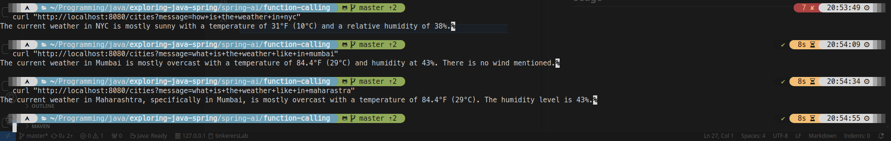

# Weather API Function Calling in Spring AI

## Overview

This project demonstrates **function calling in Spring Boot AI** by integrating an LLM (Large Language Model) with an external API—[WeatherAPI](https://www.weatherapi.com). The LLM intelligently determines when to call the Weather API to fetch real-time weather data in response to user queries.

## What is Function Calling in Spring Boot AI?

Function calling in AI refers to an LLM’s ability to invoke external APIs or functions to fetch real-time data and provide more relevant responses. Instead of relying solely on pre-trained knowledge, an AI model can call APIs dynamically when required.

In this project, we use **Spring Boot** to:

1. **Receive a user query** (e.g., *"What’s the weather like in New York?"*).
2. **Determine if an API call is needed** using an LLM.
3. **Fetch real-time weather data** from WeatherAPI.
4. **Respond to the user** with the current weather information.

## Technologies Used

- **Spring Boot** (REST API development)
- **OpenAI/LLM Integration** (for natural language understanding)
- **RestClient** (to call WeatherAPI)
- **WeatherAPI** (for weather data)

## Usage

